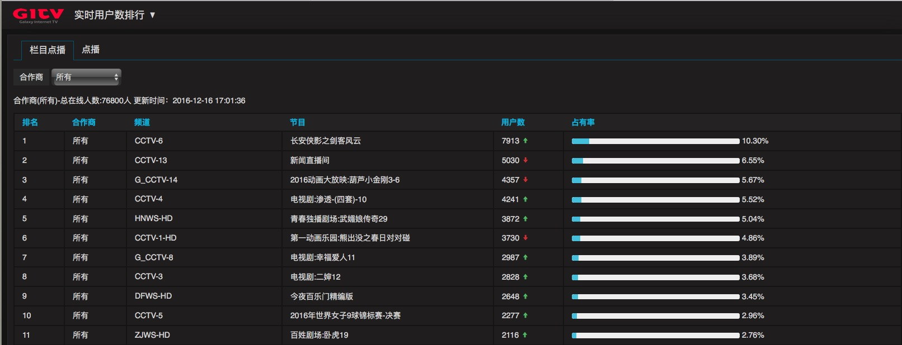
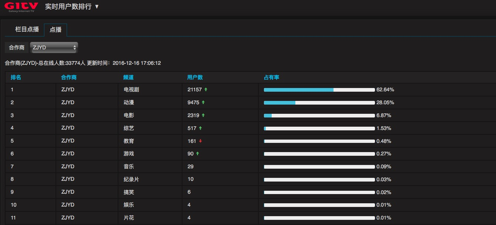

## 项目简介
统计总数&各个合作伙伴下 ``各频道人数``

区分``点播`` ``直播``用户

预览图:


----------

----------
## 命令记录

启动topo
```
/data/opt/soft/apache-storm-1.0.1/bin/storm jar rt-liv.jar cn.gitv.bi.rtliv.usercount.start.Start_up realtime_page_liv
/data/opt/soft/apache-storm-1.0.1/bin/storm jar rt-vod.jar cn.gitv.bi.rtvod.usercount.start.Start_up realtime_page_vod
```
启动40上的node.js界面
```
nohup node www.js > nohup.out 2>&1 &
```
清空linux内存缓存
```
sync; echo 3 > /proc/sys/vm/drop_caches
```
启动redis

``因为一台机的三个库db1、db2、db3可能串库，无法使用库起到数据隔离作用,使用三个conf配置文件，一台机器启动三个redis服务实例``
```
/data/opt/soft/redis-3.2.1/src/redis-server /data/opt/soft/redis-3.2.1/redis1.conf
```
```
/data/opt/soft/redis-3.2.1/src/redis-server /data/opt/soft/redis-3.2.1/redis2.conf
```
```
/data/opt/soft/redis-3.2.1/src/redis-server /data/opt/soft/redis-3.2.1/redis3.conf
```

## 项目小结
* 使用了twemproxy作hash切片，多台redis实现(抛弃)
* 使用了redis自身的ttl策略触发，ps：抽样到期失效
* 改用客户端hash选择redis连接、liv和vod分离